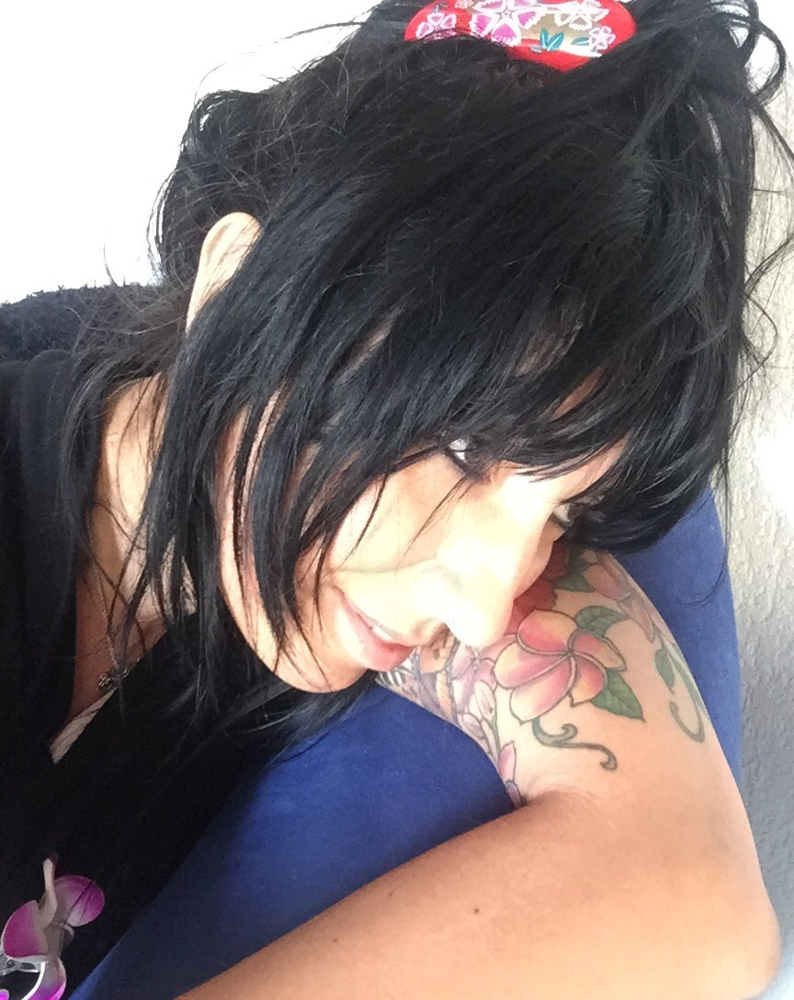

# Présentation



Je m’appelle Sandy et je suis diplômée en massage depuis 2001. J’ai travaillé en tant que masseuse aux Bains de Cressy pendant 5 ans. J’ai aussi prodigué mes soins au personnel du Crédit suisse à Genève. Puis j’ai décidé d’ouvrir mon propre cabinet où j’exerce mon métier avec passion.

Ces années de formations et de pratiques m’ont permis d’acquérir une grande expérience dans diverses techniques de massage et de faire ainsi profiter mes clients de toutes ces compétences.

Je suis une passionnée du bien-être et mon objectif est d’apporter à chaque séance une harmonie entre corps, âme et esprit.

{: class="img-responsive img-circle" }

## Formations

- Formation *massage Lomi Lomi* — 2020
- Formation *massage des 5 continents* Golden Age Village — 2018
- Formation *aromathérapie traditionnelle* École française des Médecines Douces — 2017
- Formation *massage ayurvédique abyangham-yogic* Philippe Zemp — 2008
- Formation *massage aux pierres chaudes* Art du toucher — 2006
- Stage *massage sportif* Stéphane Query — 2006
- Diplôme de *massage classique* HP-Formation — 2001
- Formation *reiki* Atelier du Reiki — 1999

## Liens

[Suzanne Himmelberger — réflexologue reflexo-lignon.ch](https://reflexo-lignon.ch/)
[Flyspa — massage à domicile flyspa.ch](https://flyspa.ch/)

---




