# Les massages et les soins énergétiques



## Nouveau 
## Massage des pieds et des mains avec bain de pieds

Découvrez mon nouveau Massage Apaisant des Pieds et des Mains
Offrez-vous un moment de pure détente avec mon tout nouveau soin apaisant pour les pieds et les mains. Ce rituel de bien-être commence par un bain de pieds revitalisant avec le sel d'Himalaya de la marque Altehara. Reconnu pour ses nombreuses vertus, ce sel de la couleur blanche correspondant à la pureté est riche en oligo-éléments essentiels qui vous apporteront une sensation de fraîcheur et de relaxation dès les premiers instants. Pendant ce bain de pieds, vous pouvez choisir de regarder une belle vidéo de la nature ou de profiter d'une méditation guidée pour une expérience encore plus relaxante.

Après ce bain de pieds relaxant, je prendrais soin de vos mains avec un massage doux et apaisant, spécialement conçu pour soulager les tensions accumulées. Enfin, je terminerais par un massage des pieds profond et enveloppant, vous offrant un moment de sérénité absolue.

Laissez-vous tenter par cette expérience unique et ressentez les bienfaits d'une détente complète pour votre corps et votre esprit.

Réservez votre séance dès aujourd'hui et redécouvrez le plaisir d'un soin apaisant et régénérant.

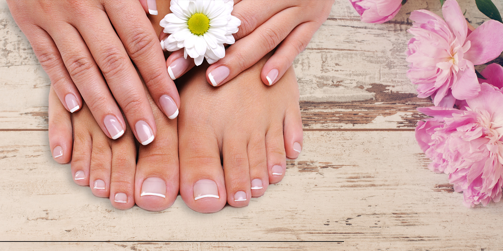{: class="img-responsive img-rounded" } 

---

## Altearah Bio Couleurs & Emotions 

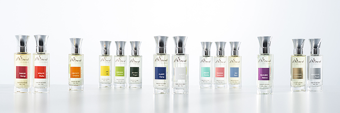{: class="img-responsive img-rounded" }

Altearah, c'est 14 couleurs exprimées en Parfums de Soin, Huiles de massage, Concentrés de Soin, Gommages et Sels de Bain. Offrant 14 synergies olfactives aromatiques uniques qui viennent instantanément rencontrer l’univers émotionnel. 

Elles vous offrent la possibilité de transformer et positiver vos émotions pour un bien-être global.

--

14 émotions couleurs, 14 synergies d'huiles essentielles. 
(Chromothérapie, aromathérapie et olfactothérapie)
14 soins hautement actifs et inspirants pour le corps et l'esprit.

--

100% naturelles, certifiées Bio, pas de tests sur les animaux, végétalien, sans parabène, sans aluminium, sans silicone…
Fabriquées dans le sud de la France.
Elles agissent au niveau physique, psycho-émotionnel et énergétique.

--

Les couleurs sont la vie, nous les percevons les utilisons chaque jours, elles expriment des énergies, des émotions, nous équilibrent et nous font vibrer.

--

Comment choisir sa couleur ?

1. Suivez votre instinct et votre attirance vers une couleur en particulier.
2. Faites votre choix grâce au mot clé associé à la couleur (Pourpre - Énergie, Blanc - Pureté, Vert - Fraîcheur,...).
3. Choisissez votre couleur en fonction de votre état émotionnel du moment (par exemple si vous êtes stressé, choisissez le Turquoise – Sérénité...).

--

Plongez-vous dans un monde de senteurs et de couleurs avec Altearah Bio et laissez parler vos émotions - la clef de votre bien-être.

--

Tous les produits de la marque Altearah sont disponibles à la vente à mon cabinet L'instant précieux.

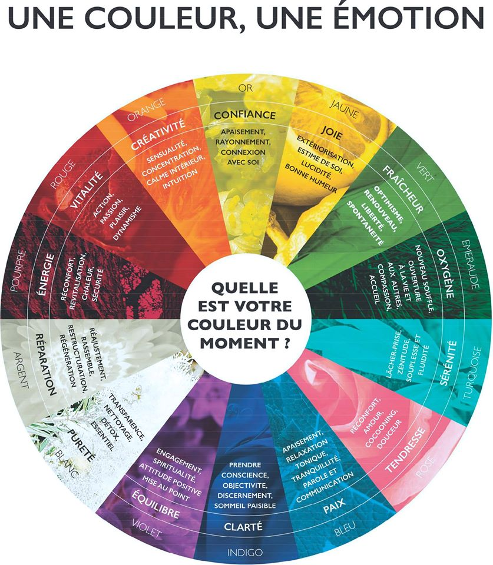{: class="img-responsive img-rounded" }

---

## Massage relaxant à l’huile de mélisse ou Altearah Couleurs & Emotions

Le massage relaxant est un massage à l’huile essentielle de mélisse ou Altearah couleurs & émotions avec des gestes fluides et englobants. Il libère du stress physique et émotionnel, améliore le sommeil et la circulation sanguine. Il calme le système nerveux, diminue les douleurs et permet de reprendre contact avec son corps et de le ressentir. L’huile essentielle de mélisse a pour vertu d’apaiser et de nous montrer le chemin vers le calme intérieur.

Ce massage est conseillé à toutes les personnes qui se sentent stressées, anxieuses, tendues par la vie quotidienne.

{: class="img-responsive img-rounded" }

---

## Synergie Energétique et Massage relaxant Altearah Couleurs & Emotions

Un rééquilibrage énergétique avec le Reiki permettra de réduire le stress, d’améliorer votre sommeil et de renforcer votre système immunitaire.
Trente minutes de Reiki et une heure de massage relaxant avec les huiles de couleurs et les parfums de soin (Alearah).

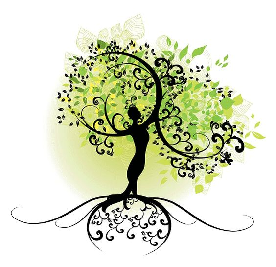{: class="img-responsive img-rounded" }

---

## Massage Hawaien Lomi Lomi

Aloha

Lomi Lomi, c‘est un soin pour tous vos sens. De l'huile parfumée, des rythmes hawaïens et des gestes qui parcourent le corps comme de douces vagues. Ce soin bien-être est exotique. Ce massage est constitué d'étirement des jambes et des bras, ainsi que de grands mouvements fluides et rythmés, effectués avec les avant-bras, les coudes et les mains sur tout le corps. Il est idéal pour chasser le stress et ce relaxer. Il est alors facile de laisser derrière soi la vie quotidienne. Envie d'un petit voyage sous les tropiques?

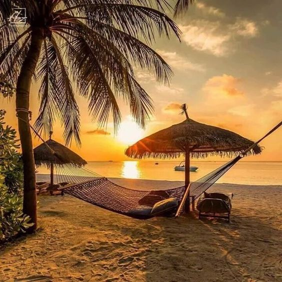{: class="img-responsive img-rounded" }

---

## Massage aux pierres chaudes 1h30 ou 2h à choix.

Découvrez la douceur des pierres volcaniques et laissez-vous envelopper par une vague de chaleur. En conjuguant les bienfaits du massage relaxant avec le travail en profondeur des pierres, ce massage vous apportera une détente musculaire en profondeur et régénératrice.

Les pierres volcaniques disposées le long des méridiens diffusent leurs douces chaleurs à tout l’organisme et procurent une profonde sensation de bien-être et de relâchement.

Un massage à découvrir ou redécouvrir durant nos longues périodes hivernales...

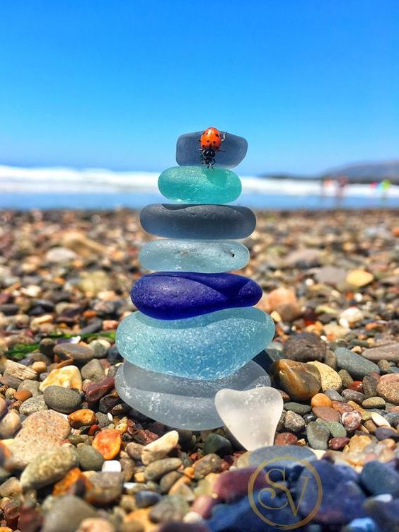{: class="img-responsive img-rounded" }

---

## Massage des 5 continents

Ce magnifique massage vous fera voyager dans différents continents réunissant divers techniques simples, d’origines variées comme le *lomi lomi*, *californien*, *suédois*, *tui na*, *ayurvédique*, *reiki* ou *magnétisme*. Il vous apportera une reconnexion à votre source et votre énergie vitale, une détox de votre corps, la libération de certaines charges émotionnelles et un lâcher-prise physique et mental.

Il vous permettra de retrouver confiance en vous, de vous aimer plus, une joie de vivre, un grand sentiment de paix et une harmonisation de l’énergie du corps et du cœur.

Vous serez emporté et reconnecté à votre énergie vitale par la puissance et l’agréable odeur des huiles essentielles réparties sur les différentes phases du massage.

La première pour la détox, la deuxième pour la relaxation et le lâcher-prise, la dernière pour la revitalisation et la stimulation du système immunitaire.

À découvrir absolument !

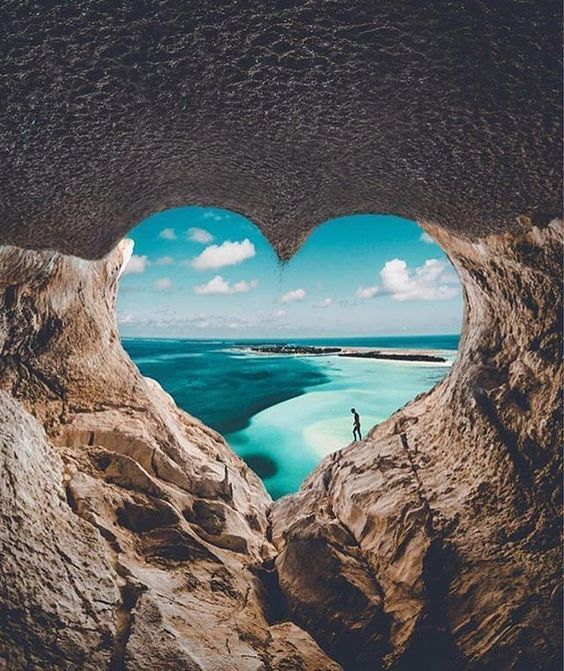{: class="img-responsive img-rounded" }

---

## Massage ayurvédique abhyanga

Originaire d’Inde, ce massage à l’huile tiède de sésame fait voyager les sens et permet de rééquilibrer notre corps et ses fonctions.

Un soin particulièrement indiqué aux personnes stressées, surmenées, fatiguées et à tous ceux qui ont du mal à décrocher.

À la fois relaxant et énergisant, il est très efficace pour réduire la tension nerveuse et dynamiser la circulation sanguine.

Il élimine tensions, nœuds et raideurs, draine les lymphes et harmonise votre psyché tout en vous relaxant.

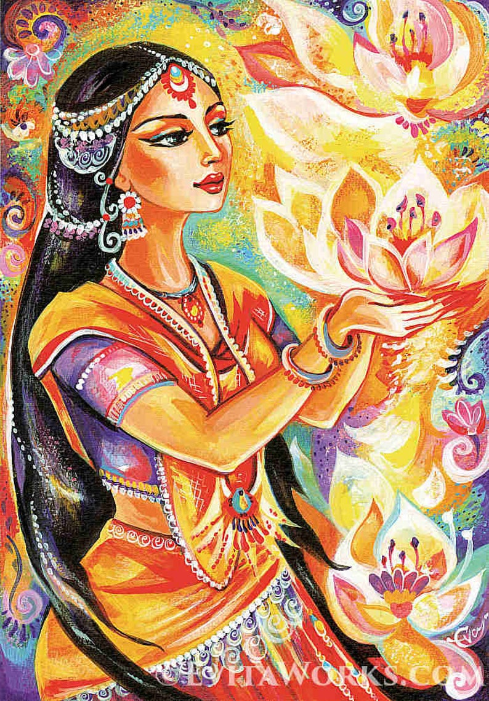{: class="img-responsive img-rounded" }

---

## Essentiel dos & nuque

Le dos est le pilier de notre corps. Notre vie stressante et pesante engendre des tensions, raideurs, douleurs des épaules et de la nuque, qui alourdissent notre vie quotidienne.

Le massage du dos a des vertus relaxantes. Dès la première séance, il permet de relâcher les nœuds musculaires et de les assouplir.

Il soulage les douleurs, libère les tensions nerveuses et détend par conséquent le corps tout entier. Vous vous sentirez beaucoup plus léger comme libéré d’un poids sur vos épaules.

Ne dit-on pas : “J’en ai plein le dos !”

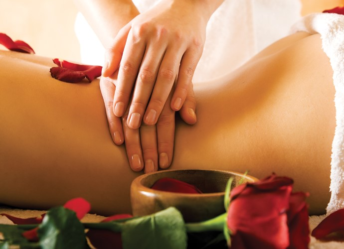{: class="img-responsive img-rounded" }

---

## Essentiel jambes légères

Nos jambes sont mises chaque jour à rude épreuve. Elles doivent non seulement supporter le poids du corps, mais parfois aussi rester immobiles pendant des heures.

Le massage des jambes aux huiles essentielles active la circulation sanguine, délasse les membres fatigués et tonifie le système veineux.

Accordez à vos jambes ce massage pour renouer avec la légèreté.

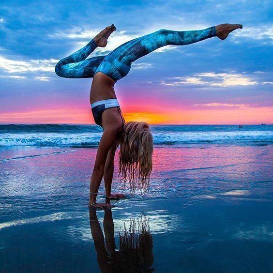{: class="img-responsive img-rounded" }

---

# Energétiques

## Soins Energétiques avec les Parfums Altearah couleurs et émotions

Normalement, dans le corps humain, l'énergie circule librement selon un circuit déterminé et elle nous apporte bien-être et bonne santé.
En cas de maladie l'énergie est bloqué apportant des vides et des trop pleins à certain endroits.

Les soins énergétiques lèvent ces blocages, remontent les énergies, harmonisent la circulation énergétique.
Relance le processus d'auto réparation.

## Comment se déroule une scéance?

En premier lieu nous parlerons de l'objet de votre venue et instaurerons ensemble une mise en confiance. 
Puis, confortablement allongé et habillé sur une table de massage, je vous ferais respirer un parfum de soin de la marque Altearah que vous aurez choisi préalablement la couleur. Puis vous serez emmener avec une douce musique à vous détendre et à vous relaxer.
Je passerais ensuite mes mains au dessus de votre corps afin de recentrer vos corps subtils, éliminer les émotions négatives et les énergies nuisibles, détecter les blocages énergétiques, harmoniser les chakras, relancer et recharger la circulation énergétique, régulation du mouvement primordial.

## Vous pouvez faire ce soin soit.

En prévention pour garder une bonne santé.
Pour soulager les chocs émotionnels, les états dépressifs, le stress, les angoisses, les peurs etc....
Pour atténuer tous les problèmes de santé. Douleurs diverses, maladies etc.....

Ce soin peut être fait en soutien à la médecine traditionnelle à tout âge aussi bien pour les enfants, les femmes enceintes et les personnes âgées.

Je suis une énergéticienne à votre écoute et prêtes à vous aider.

(Soin énergétique enseigné par le Dr. Luc Bodin)

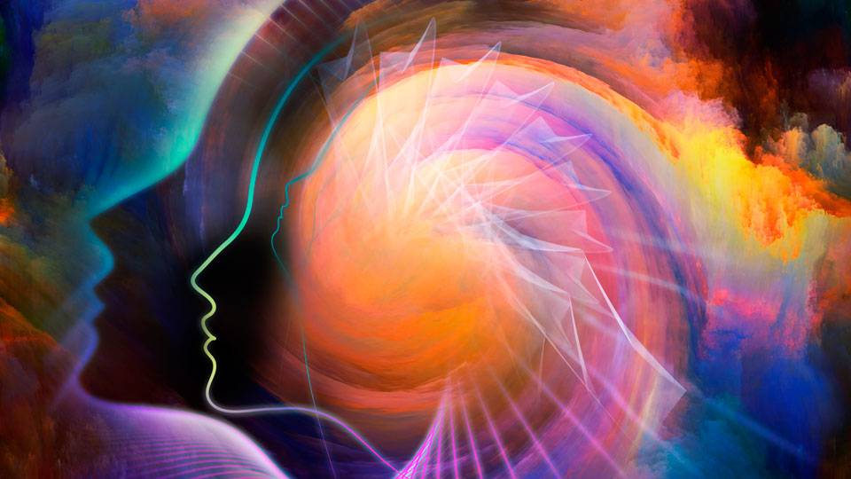{: class="img-responsive img-rounded" }

---

## Reiki & Altearah Couleurs & Emotions

Le *reiki* est une méthode naturelle très douce et très profonde qui apporte un supplément d’énergie pour harmoniser et équilibrer les centres d’énergie du corps. Il libère les tensions, les blocages physiques et émotionnels. Il permet de retrouver et de développer sa relation à soi et ainsi de se reconnecter en profondeur.

Il apporte ainsi apaisement et mieux-être.

> Le *reiki* n’est pas un massage mais une méthode de soin énergétique par le toucher.

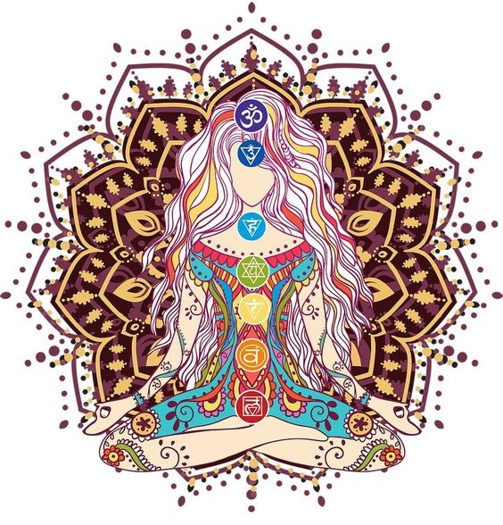{: class="img-responsive img-rounded" }

---






