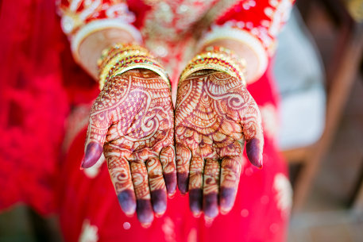

# Les massages



## Massage relaxant à l’huile essentielle de mélisse ou à l'huile de coco pour l'été.

Le massage relaxant est un massage à l’huile essentielle de mélisse avec des gestes fluides et englobants. Il libère du stress physique et émotionnel, améliore le sommeil et la circulation sanguine. Il calme le système nerveux, diminue les douleurs et permet de reprendre contact avec son corps et de le ressentir. L’huile essentielle de mélisse a pour vertu d’apaiser et de nous montrer le chemin vers le calme intérieur.

Ce massage est conseillé à toutes les personnes qui se sentent stressées, anxieuses, tendues par la vie quotidienne.

{: class="img-responsive img-rounded" }

---

## Massage aux pierres chaudes de basalte

Découvrez la douceur des pierres volcaniques et laissez-vous envelopper par une vague de chaleur. En conjuguant les bienfaits du massage relaxant avec le travail en profondeur des pierres, ce massage vous apportera une détente musculaire en profondeur et régénératrice.

Les pierres volcaniques disposées le long des méridiens diffusent leurs douces chaleurs à tout l’organisme et procurent une profonde sensation de bien-être et de relâchement.

Un massage à découvrir ou redécouvrir durant nos longues périodes hivernales...

{: class="img-responsive img-rounded" }

---

## Massage ayurvédique abhyanga

Originaire d’Inde, ce massage à l’huile tiède de sésame fait voyager les sens et permet de rééquilibrer notre corps et ses fonctions. Un soin particulièrement indiqué aux personnes stressées, surmenées, fatiguées et à tous ceux qui ont du mal à décrocher. À la fois relaxant et énergisant, il est très efficace pour réduire la tension nerveuse et dynamiser la circulation sanguine. Il élimine tensions, nœuds et raideurs, draine les lymphes et harmonise votre psyché tout en vous relaxant.

{: class="img-responsive img-rounded" }

---

## Massage à la bougie

Le massage à la bougie est un merveilleux moment de détente et de sérénité absolues qui allie agréablement la douceur et la chaleur. La bougie diffuse des senteurs et embaume la pièce créant ainsi une atmosphère zen.

{: class="img-responsive img-rounded" }

---

## Essentiel dos+nuque

Le dos est le pilier de notre corps. Notre vie stressante et pesante engendre des tensions, raideurs, douleurs des épaules et de la nuque, qui alourdissent notre vie quotidienne. Le massage du dos a des vertus relaxante. Dès la première séance, il permet de relâcher les noeuds musculaires et de les assouplir. Il soulage les douleurs, libère les tensions nerveuses et détend par conséquent, le corps tout entier. Vous vous sentirez beaucoup plus léger comme libéré d'un poids sur vos épaules. Ne dit-on pas. J'en ai pleins le dos. 

!(images/massage-confignon-massage-essentiel-dos.jpg){: class="img-responsive img-rounded" }
---

## Essentiel jambes légères

Nos jambes sont mises chaque jour à rude épreuve. Elles doivent non seulement supporter le poids du corps, mais parfois aussi rester immobiles pendant des heures. Le massage des jambes aux huiles essentielles active la circulation sanguine, délasse les membres fatigués et tonifie le système veineux. Accordez à vos jambes ce massage pour renouer avec la légèreté.

---

## Reiki

Le *reiki* est une méthode naturelle très douce et très profonde qui apporte un supplément d’énergie pour harmoniser et équilibrer les centres d’énergie du corps. Il libère les tensions, les blocages physiques et émotionnels. Il permet de retrouver et de développer sa relation à soi et ainsi de se reconnecter en profondeur. Il apporte ainsi apaisement et mieux-être.

> Le *reiki* n’est pas un massage mais une méthode de soin énergétique par le toucher.

{: class="img-responsive img-rounded" }
